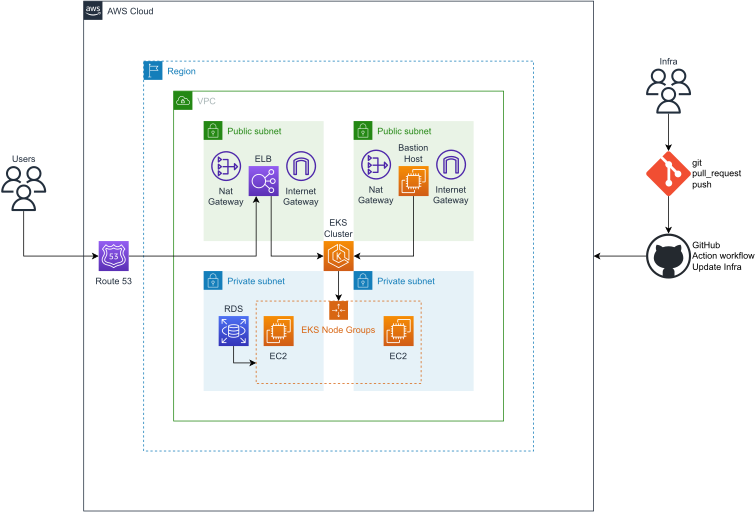

# Cloud Native n-tier Architecture

## Requirements

The design should be:

* Autoscalable. Be ready to support spikes in traffic.
* Include a JS frontend (SPA).
* Support the deployment of multiple microservices.
* Include 3 environments: _dev_, _stg_, _prod_.
* Include a PostgreSQL DB or a MongoDB.
* Include a CI/CD solution for managing the deployment of the application.
* Include a GitOps solution for managing the infrastructure.
* Developded via Terraform.

The design should:

* Minimize operational overhead.
* Optimized for cost.
* Make use of distributed solutions and support fail-over.
* Be explicit about the network design.
* Include a working app.

## Solution Proposed

First, I design a _virtual private cloud_ with one public subnet that contains a _bastion host_ to access resources on the second subnet of private character through a _NAT gateway_. Then, regarding the requirements related to microservices implementation, I decided to use a containerized solution through _Elastic Kubernetes Services_ which would allow managing a cluster of containers while taking care of health monitoring its integrity, autoscaling when necessary, and scheduling to assign pods to a particular node, which will be running on _node groups of EC2 instances_. This would allow the deployment of an application coded both in server-side JavaScript and client-side JavaScript. On the other hand, to address the database requirement, Amazon Relational Database Service _(Amazon RDS)_ comes in handy to deploy a fully managed PostgreSQL Database on the Backend.

Even though the design mentioned above allows the deployment of the application, this guarantees neither a distributed solution nor a fault-tolerant system. Therefore, I decided to include a multi-availability zone combined with an auto-scaling group architecture to approach this matter. Hence, the two initial subnets are replicated on at least another availability zones and, the cluster nodes are configured to be auto-scalable all over the VPC. At this point there is a high availability solution on a computational focus; nevertheless, it needs some help to be fault tolerant on the backend side. So, in order to have a more resilient design, RDS also allows setting auto-scaling configurations to the tier.

Next, there were used two network resources to guarantee the proper performance of the application, the first one was _Route 53_ which allows the application to be consumed using an FQDM, and the second was an _elastic load balancer_ to distribute the load seamlessly to the Frontend and to the clients. Finally, the creation of the cloud-native resources on the different environments is achieved through a _GitHub Action_ and _Terraform_.

### Architecture Diagram

<div align=center>
    
</div>

### GitHub Action

A GitHub context-based condition has been implemented to select which workspace to update, i.e. prod, dev or stg. This is achieved through the following workflow:

```
name: Update aws infrastructure using terrafom

run-name: ${{ github.actor }} is updating the aws infrastructure 🚀

on:
  pull_request:
    types:
      [opened,synchronize,closed]
    branches:
      - develop
      - main
  push:
    branches:
      - develop
      - hot_fix*
      - release_*

jobs:
  Update-infra:
    runs-on: ubuntu-latest
    steps:
      - name: Checkout
        uses: actions/checkout@v3

      - name: Install terraform
        uses: hashicorp/setup-terraform@v2
        with:
          terraform_version: 1.3.4
          cli_config_credentials_token: ${{ secrets.TF_API_TOKEN }}

      - name: Install aws
        uses: aws-actions/configure-aws-credentials@v1-node16
        with:
          aws-access-key-id: ${{ secrets.AWS_ACCESS_KEY_ID }}
          aws-secret-access-key: ${{ secrets.AWS_SECRET_ACCESS_KEY }}
          aws-region: us-east-1

      - name: Terraform fmt
        id: fmt
        run: terraform fmt -check
        continue-on-error: true

      - name: Terraform Workspace
        id: workspace
        run: |
          if [[ $GITHUB_EVENT_NAME == "pull_request" ]]; then
            if [[ $GITHUB_BASE_REF == "main" ]]; then
              terraformWorkspace=prod
            elif [[ $GITHUB_BASE_REF == "^relase_.*|^hot_fix_*" ]]; then
              terraformWorkspace=stg
            else
              terraformWorkspace=dev
            fi
            echo "TF_WORKSPACE=$terraformWorkspace" >> $GITHUB_ENV
          else
            if [[ $GITHUB_REF_NAME == "main" ]]; then
              terraformWorkspace=prod
            elif [[ $GITHUB_REF_NAME == "^relase_.*|^hot_fix_*" ]]; then
              terraformWorkspace=stg
            else
              terraformWorkspace=dev
            fi
            echo "TF_WORKSPACE=terraformWorkspace" >> $GITHUB_ENV
          fi

      - name: Terraform Init
        id: init
        run: terraform init

      - name: Terraform Validate
        id: validate
        run: terraform validate -no-color

      - name: Terraform Plan
        id: plan
        run: terraform plan -no-color

      - name: Terraform Apply
        id: apply
        if: ${{ ( ( steps.plan.outcome == 'success' ) && ( github.event_name != 'pull_request' ) ) || ( github.event.pull_request.merged == true ) }}
        run: terraform apply -auto-approve

      - name: Terraform Output
        id: output
        if: ${{ success() && steps.apply.conclusion == 'success' }}
        run: terraform output -no-color

      - name: Summary
        if: ${{ success() && steps.apply.conclusion == 'success' }}
        run: |
          echo "## Terraform workspace" >> $GITHUB_STEP_SUMMARY
          echo "$TF_WORKSPACE" >> $GITHUB_STEP_SUMMARY
          echo "" >> $GITHUB_STEP_SUMMARY
          echo "## Terraform plan" >> $GITHUB_STEP_SUMMARY
          echo "${{ steps.plan.outputs.stdout }}" >> $GITHUB_STEP_SUMMARY
          echo "" >> $GITHUB_STEP_SUMMARY
          echo "## Terraform outputs" >> $GITHUB_STEP_SUMMARY
          echo "${{ steps.output.outputs.stdout }}" >> $GITHUB_STEP_SUMMARY
```